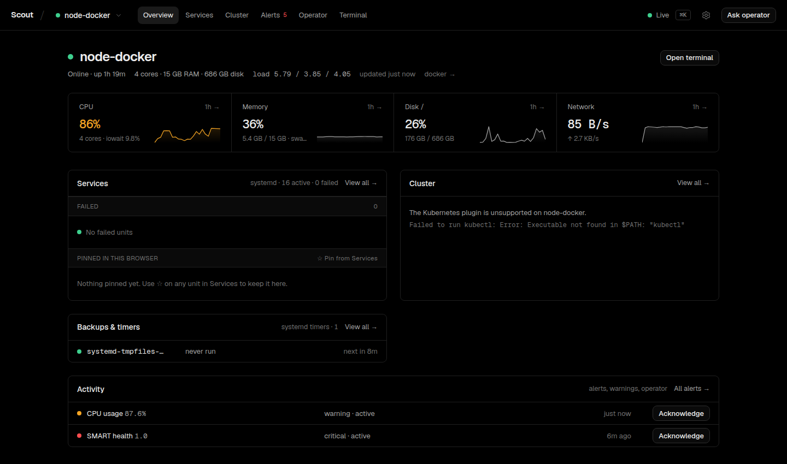

# Scout

[](https://github.com/AryaLabsHQ/scout/actions/workflows/ci.yml)

Scout is a self-hosted control plane for a small fleet of Linux machines. A lightweight agent on
each machine reports host metrics plus what runs there (systemd units, Docker containers, Kubernetes
workloads, tunnels and reverse proxies), and one dashboard shows it all live, raises alerts, and
runs the actions plugins expose, such as restarting a unit or reading its journal.



Scout is a Bun + Effect monorepo split into three runtime apps:

- `agent`: runs on nodes, collects host and plugin data, and executes management actions
- `hub`: stores state, ingests reports, evaluates alerts, and serves REST + RPC APIs
- `web`: TanStack Start dashboard that bootstraps over HTTP and stays live over RPC

Shared contracts and plugin surfaces live in `packages/`, and `e2e/` provides a Docker-based lab for end-to-end testing.

## Architecture

```text
managed node
  └─ apps/agent
       ├─ built-in collectors
       ├─ plugin runtimes
       └─ reports to / accepts commands from

control plane
  └─ apps/hub
       ├─ SQLite + Drizzle persistence
       ├─ alerting + retention
       ├─ REST bootstrap endpoints
       └─ browser/agent WebSocket RPC

dashboard
  └─ apps/web
       ├─ SSR bootstrap via hub HTTP
       └─ live state via AtomRpc HubClient
```

Cross-runtime shapes come from [`packages/shared`](./packages/shared/README.md), and plugin discovery/execution is defined in [`packages/plugin-sdk`](./packages/plugin-sdk/README.md).

## Monorepo Layout

| Path                                                             | Purpose                                                           |
| ---------------------------------------------------------------- | ----------------------------------------------------------------- |
| [`apps/agent`](./apps/agent/README.md)                           | Node-side runtime for collection, reporting, and action execution |
| [`apps/hub`](./apps/hub/README.md)                               | Hub service, database, alert engine, and RPC server               |
| [`apps/web`](./apps/web/README.md)                               | Dashboard UI and browser RPC client                               |
| [`packages/shared`](./packages/shared/README.md)                 | Shared schemas, types, and RPC groups                             |
| [`packages/plugin-sdk`](./packages/plugin-sdk/README.md)         | Plugin manifest, loader, and execution SDK                        |
| [`packages/plugin-docker`](./packages/plugin-docker/README.md)   | Docker integration plugin                                         |
| [`packages/plugin-edge`](./packages/plugin-edge/README.md)       | cloudflared tunnel and Caddy reverse-proxy health (read-only)     |
| [`packages/plugin-k8s`](./packages/plugin-k8s/README.md)         | Kubernetes integration plugin                                     |
| [`packages/plugin-systemd`](./packages/plugin-systemd/README.md) | systemd integration plugin                                        |
| [`deploy`](./deploy/README.md)                                   | Self-hosting kit: systemd units, env templates, Caddy, RBAC       |
| [`e2e`](./e2e/README.md)                                         | Docker test lab for exercising the full stack                     |

## Getting Started

### Prerequisites

- Bun `1.4.x` (the exact version is `packageManager` in `package.json`)
- Docker for the optional E2E harness

### Install Dependencies

```bash
bun install
```

### Workspace Commands

```bash
# Run all workspace dev tasks
bun run dev

# Build all workspaces
bun run build

# Typecheck all workspaces
bun run typecheck

# Run every workspace's tests
bun run test

# Lint and format
bun run lint
bun run format
```

### Typical Local Flow

```bash
# Terminal 1: hub
cd apps/hub
bun --env-file=.env.test run db:push
bun --env-file=.env.test run dev

# Terminal 2: web
cd apps/web
bun --env-file=.env.test run dev

# Terminal 3: optional Docker E2E lab
cd e2e
./scripts/up.sh
```

Open `http://localhost:3000` for the dashboard and `http://localhost:3001/health` for hub health.

## Self-Hosting

[`deploy/README.md`](./deploy/README.md) walks through running Scout on your own machines: the hub
and dashboard as `systemd --user` units behind a reverse proxy and Cloudflare Access, an agent on
every host, remote agents over a private network, and upgrades and rollback. Every file there uses
placeholders; keep your site-specific config in your own infrastructure repo.

## Development Notes

- The root `README` is the public landing page. Deeper implementation guidance lives in the repo's `AGENTS.md` files.
- The hub is the system of record: agents report into it, and the web app reads bootstrap data or subscribes to live updates from it.
- Plugin packages are discovered dynamically from the workspace `packages/` directory unless overridden by `SCOUT_PLUGIN_DIR`.

## More Docs

- [`CONTRIBUTING.md`](./CONTRIBUTING.md): setup, checks, and pull request conventions
- [`AGENTS.md`](./AGENTS.md): repo-wide engineering map and implementation guidance
- [`docs/architecture.md`](./docs/architecture.md): full system architecture
- [`docs/plugins/README.md`](./docs/plugins/README.md): how plugins work and how to write one
- [`docs/operator/README.md`](./docs/operator/README.md): the Operator, Scout's built-in AI assistant
- [`e2e/README.md`](./e2e/README.md): detailed Docker harness usage
- [`docs/e2e-testing.md`](./docs/e2e-testing.md): alternate E2E quick start and troubleshooting

## License

[MIT](./LICENSE)
